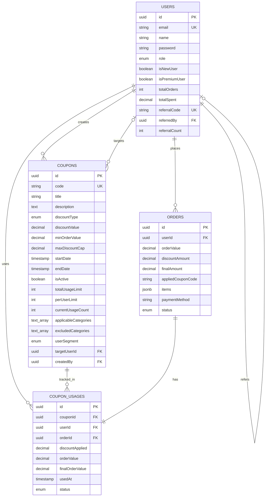

# Database Schema Diagram

## Entity Relationship Diagram

```
┌─────────────────────────────────────────────────────────────────────────┐
│                           COUPON MANAGEMENT SYSTEM                      │
│                              Database Schema                            │
└─────────────────────────────────────────────────────────────────────────┘

┌─────────────────────────────────────────────────────────────────────────┐
│                              USERS TABLE                                 │
├─────────────────────────────────────────────────────────────────────────┤
│ PK  id                    UUID                    (Primary Key)         │
│     email                 VARCHAR(255)            (Unique, Not Null)   │
│     name                  VARCHAR(255)            (Not Null)            │
│     phone                 VARCHAR(50)             (Not Null)            │
│     password              VARCHAR(255)             (Not Null, Hashed)    │
│     role                  ENUM('customer','admin') (Default: 'customer')│
│     isNewUser             BOOLEAN                  (Default: true)      │
│     isPremiumUser         BOOLEAN                  (Default: false)     │
│     totalOrders           INTEGER                  (Default: 0)          │
│     totalSpent            DECIMAL(10,2)            (Default: 0)          │
│     referralCode          VARCHAR(50)              (Unique, Nullable)   │
│     referredBy            UUID                     (Nullable, FK→users) │
│     referralCount         INTEGER                  (Default: 0)          │
│     isActive              BOOLEAN                  (Default: true)      │
│     joinedAt             TIMESTAMP                (Auto)               │
│     createdAt             TIMESTAMP                (Auto)               │
│     updatedAt             TIMESTAMP                (Auto)               │
└─────────────────────────────────────────────────────────────────────────┘
                                    │
                                    │ 1:N
                                    │
                                    ▼
┌─────────────────────────────────────────────────────────────────────────┐
│                            COUPONS TABLE                                 │
├─────────────────────────────────────────────────────────────────────────┤
│ PK  id                    UUID                    (Primary Key)         │
│     code                  VARCHAR(50)              (Unique, Not Null)   │
│     title                 VARCHAR(255)             (Not Null)            │
│     description           TEXT                     (Not Null)            │
│     discountType          ENUM('percentage',      (Not Null)            │
│                              'fixed_amount',                            │
│                              'free_delivery')                            │
│     discountValue         DECIMAL(10,2)           (Not Null)            │
│     minOrderValue         DECIMAL(10,2)           (Not Null)            │
│     maxDiscountCap        DECIMAL(10,2)           (Nullable)            │
│     startDate             TIMESTAMP                (Not Null)           │
│     endDate               TIMESTAMP                (Not Null)           │
│     isActive              BOOLEAN                  (Default: true)     │
│     totalUsageLimit       INTEGER                  (Nullable)           │
│     perUserLimit          INTEGER                  (Nullable)           │
│     currentUsageCount     INTEGER                  (Default: 0)         │
│     applicableCategories  TEXT[]                   (Nullable)           │
│     applicableProducts    TEXT[]                   (Nullable)           │
│     excludedCategories    TEXT[]                   (Nullable)           │
│     excludedProducts      TEXT[]                   (Nullable)           │
│     userSegment           ENUM('all','new_users',  (Default: 'all')     │
│                              'premium_users')                            │
│     minPurchaseCount      INTEGER                  (Nullable)           │
│     paymentMethods        TEXT[]                   (Nullable)           │
│     targetUserId          UUID                     (Nullable, FK→users) │
│ FK  createdBy            UUID                     (Not Null, FK→users) │
│     createdAt             TIMESTAMP                (Auto)               │
│     updatedAt             TIMESTAMP                (Auto)               │
└─────────────────────────────────────────────────────────────────────────┘
         │                                                      │
         │ 1:N                                                  │ 1:N
         │                                                      │
         ▼                                                      ▼
┌──────────────────────────────────────┐    ┌──────────────────────────────────────┐
│        COUPON_USAGES TABLE           │    │          ORDERS TABLE                 │
├──────────────────────────────────────┤    ├──────────────────────────────────────┤
│ PK  id                    UUID       │    │ PK  id                    UUID       │
│ FK  couponId              UUID       │    │ FK  userId                 UUID       │
│ FK  userId                UUID       │    │     orderValue             DECIMAL   │
│ FK  orderId               UUID       │    │     discountAmount          DECIMAL   │
│     discountApplied       DECIMAL   │    │     finalAmount             DECIMAL   │
│     orderValue            DECIMAL   │    │     appliedCouponCode       VARCHAR   │
│     finalOrderValue       DECIMAL   │    │     items                   JSONB      │
│     usedAt                TIMESTAMP │    │     paymentMethod           VARCHAR   │
│     status                ENUM       │    │     status                  ENUM      │
│                                      │    │     createdAt               TIMESTAMP │
└──────────────────────────────────────┘    └──────────────────────────────────────┘
         │                                                      │
         │                                                      │
         └──────────────────┬───────────────────────────────────┘
                            │
                            │ 1:1 (CouponUsage.orderId → Order.id)
                            │
```

## Relationships

### 1. User → Coupon (1:N)
- **Relationship**: One user (admin) can create many coupons
- **Foreign Key**: `coupons.createdBy` → `users.id`
- **Constraint**: Admin users only

### 2. User → Order (1:N)
- **Relationship**: One user can place many orders
- **Foreign Key**: `orders.userId` → `users.id`
- **Constraint**: Customer users typically

### 3. User → CouponUsage (1:N)
- **Relationship**: One user can use many coupons
- **Foreign Key**: `coupon_usages.userId` → `users.id`

### 4. Coupon → CouponUsage (1:N)
- **Relationship**: One coupon can be used many times
- **Foreign Key**: `coupon_usages.couponId` → `coupons.id`

### 5. Order → CouponUsage (1:1)
- **Relationship**: One order has one coupon usage record
- **Foreign Key**: `coupon_usages.orderId` → `orders.id`
- **Constraint**: NOT NULL (coupon usage must have an order)

### 6. User → User (Self-Referential)
- **Relationship**: Referral system (user referred by another user)
- **Foreign Key**: `users.referredBy` → `users.id`
- **Constraint**: Nullable (not all users have referrers)

### 7. User → Coupon (User-Specific Coupons)
- **Relationship**: Coupons can be targeted to specific users
- **Foreign Key**: `coupons.targetUserId` → `users.id`
- **Constraint**: Nullable (null = global coupon)

## Data Types & Constraints

### Enums

**UserRole:**
- `customer` - Regular customer
- `admin` - Administrator

**DiscountType:**
- `percentage` - Percentage discount (e.g., 10%)
- `fixed_amount` - Fixed amount discount (e.g., ₹100)
- `free_delivery` - Free delivery discount

**UserSegment:**
- `all` - Available to all users
- `new_users` - Only for new users
- `premium_users` - Only for premium users

**OrderStatus:**
- `pending` - Order placed, pending confirmation
- `confirmed` - Order confirmed
- `delivered` - Order delivered
- `cancelled` - Order cancelled

**CouponUsageStatus:**
- `applied` - Coupon successfully applied
- `refunded` - Coupon usage refunded (order cancelled)
- `expired` - Coupon expired before use

### Array Fields (PostgreSQL Arrays)

**Coupon Entity:**
- `applicableCategories`: `TEXT[]` - Categories where coupon applies
- `applicableProducts`: `TEXT[]` - Product IDs where coupon applies
- `excludedCategories`: `TEXT[]` - Categories excluded from coupon
- `excludedProducts`: `TEXT[]` - Product IDs excluded from coupon
- `paymentMethods`: `TEXT[]` - Allowed payment methods

**Validation Rules:**
- `applicableCategories` ∩ `excludedCategories` = ∅ (no overlap)
- `applicableProducts` ∩ `excludedProducts` = ∅ (no overlap)

### JSONB Fields

**Order Entity:**
- `items`: JSONB array of:
  ```typescript
  {
    productId: string;
    quantity: number;
    price: number;
    category?: string;
  }[]
  ```

**Benefits:**
- Flexible schema for order items
- Can store additional metadata
- Queryable with PostgreSQL JSONB operators

## Indexes (Recommended)

```sql
-- Primary Keys (Auto-indexed)
users.id (PK)
coupons.id (PK)
orders.id (PK)
coupon_usages.id (PK)

-- Unique Indexes
users.email (UNIQUE)
users.referralCode (UNIQUE)
coupons.code (UNIQUE)

-- Foreign Key Indexes (Auto-created by TypeORM)
coupons.createdBy → users.id
coupons.targetUserId → users.id
orders.userId → users.id
coupon_usages.couponId → coupons.id
coupon_usages.userId → users.id
coupon_usages.orderId → orders.id

-- Performance Indexes (Recommended)
coupons.isActive
coupons.startDate, coupons.endDate
coupon_usages.status
coupon_usages.usedAt
orders.status
orders.createdAt
```

## Business Rules Enforced at Database Level

1. **Coupon Code Uniqueness**: `UNIQUE` constraint on `coupons.code`
2. **Email Uniqueness**: `UNIQUE` constraint on `users.email`
3. **Referral Code Uniqueness**: `UNIQUE` constraint on `users.referralCode`
4. **Order-CouponUsage Relationship**: `NOT NULL` on `coupon_usages.orderId`
5. **Decimal Precision**: All monetary values use `DECIMAL(10,2)` for accuracy

## Data Flow

### Coupon Application Flow
```
1. User selects coupon → GET /coupons/available
2. User validates coupon → POST /coupons/:code/validate
3. User applies coupon → POST /coupons/:code/apply
   └─> Transaction with pessimistic lock
   └─> Increment currentUsageCount
4. User creates order → POST /orders
   └─> Create Order record
   └─> Create CouponUsage record (links to Order)
5. Order cancellation → DELETE /orders/:id
   └─> Update CouponUsage.status = 'REFUNDED'
   └─> Decrement coupon.currentUsageCount
```

### Referral Flow
```
1. User registers with referral code → POST /auth/register
2. System finds referrer → users.referralCode = referralCode
3. System creates coupons:
   └─> Referrer coupon (₹100, user-specific)
   └─> Referee coupon (₹50, user-specific)
4. System updates:
   └─> referrer.referralCount += 1
   └─> newUser.referredBy = referrer.id
```

## Schema Statistics

- **Total Tables**: 4 (users, coupons, orders, coupon_usages)
- **Total Relationships**: 7 (including self-referential)
- **Total Enums**: 5 (UserRole, DiscountType, UserSegment, OrderStatus, CouponUsageStatus)
- **Array Fields**: 5 (all in coupons table)
- **JSONB Fields**: 1 (orders.items)

## Migration Strategy

TypeORM handles migrations automatically with `synchronize: false` in production:
- Development: `synchronize: true` (auto-sync)
- Production: Manual migrations via `migration:generate` and `migration:run`

---

## Visual Schema Representation (Mermaid)



---

## Notes

1. **Soft Deletes**: Coupons use `isActive: false` instead of hard deletion
2. **Audit Trail**: All entities have `createdAt` and `updatedAt` timestamps
3. **Flexibility**: Array and JSONB fields allow schema evolution without migrations
4. **Performance**: Indexes on frequently queried fields (status, dates, foreign keys)
5. **Data Integrity**: Foreign key constraints ensure referential integrity

